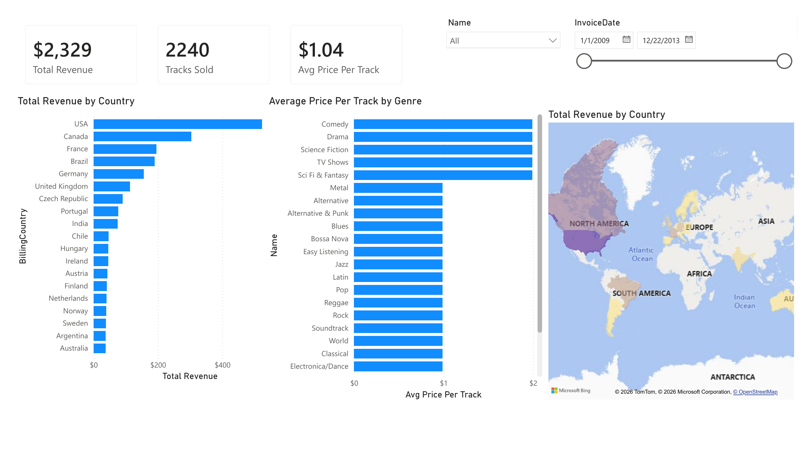
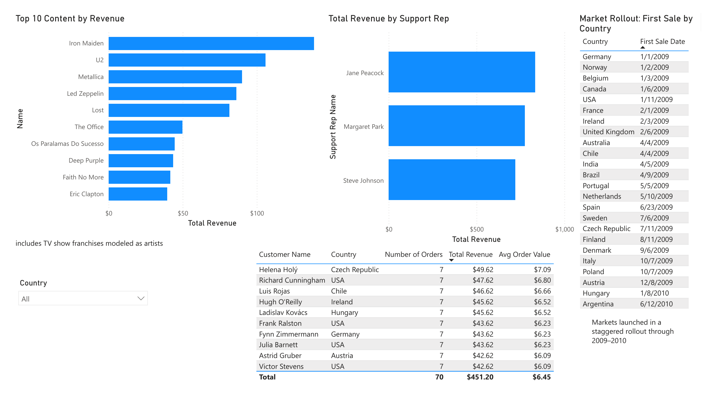

# Chinook Music Store: SQL + Power BI Analysis
 
A SQL-driven analysis of a digital music/media store, paired with a two-page Power BI dashboard — built to demonstrate relational database querying alongside BI dashboard design, rather than just another flat-file project.

**Overview**

 
**Deep Dive**

 
## Project overview
 
This project analyzes the [Chinook database](https://github.com/lerocha/chinook-database), a sample digital media store with 11 normalized tables (customers, invoices, tracks, albums, artists, genres, employees, and more) spanning sales from 2009–2013. Unlike this portfolio's other projects, which started from a single flat spreadsheet, Chinook is genuinely relational. This answers even simple questions requires joining across multiple tables.
 
The goal was to:
1. Write and validate SQL queries directly against the database (SQLite, via DB Browser for SQLite)
2. Export the underlying tables and rebuild the same relationships in Power BI
3. Confirm the Power BI model reproduces the validated SQL results exactly
4. Build a two-page dashboard around the genuine findings the SQL analysis surfaced

## Tools used
 
- **DB Browser for SQLite** — querying, joins, validation
- **Power BI** — data modeling, DAX, dashboard design

## Process
 
1. **SQL analysis** (see `chinook_analysis_queries.sql`): six queries, progressing from a single-table aggregation up through multi-table joins (InvoiceLine → Track → Album → Artist, and Invoice → Customer → Employee).
2. **Export to CSV**: rather than maintaining a live ODBC connection, the validated tables were exported to CSV and re-imported into Power BI. This is a deliberate simplification for a portfolio project, with the trade-off (no live refresh from the source database) noted rather than hidden.
3. **Rebuilt the relational model in Power BI**: 7 relationships connecting all 8 relevant tables, with `InvoiceLine` as the true fact table at the center.
4. **Cross-validated**: every Power BI measure was checked against its SQL equivalent before being trusted in a chart (e.g., genre revenue/pricing matched to the cent; support rep revenue matched exactly).

## Key findings
 
- **A clean two-tier pricing structure.** Every music genre prices at exactly $0.99/track; every video genre (TV Shows, Drama, Sci Fi & Fantasy, Comedy, Science Fiction) prices at exactly $1.99/track. No genre falls outside this split.
- **"Top Artists" includes TV show franchises.** Chinook models TV series like *Lost* and *The Office* using the same Artist/Album/Track structure as music, since both are valid top-10 revenue entries. The dashboard is titled "Top Content by Revenue" rather than "Top Artists" to reflect this accurately.
- **A genuine staggered market rollout.** Core markets (Germany, Norway, Belgium, Canada, USA) all received their first sale within the first two weeks of January 2009. Argentina's first sale didn't occur until June 2010 — a year and a half later. This is a real, verifiable pattern (confirmed via `MIN(InvoiceDate)` per country), not a data-generation artifact.
- **Support rep revenue scales with assigned customer count, not performance.** All three reps generate almost identical revenue-per-customer (~$39–40), meaning differences in their total revenue reflect how many customers they were assigned, not differing sales skill.
- **Customer ranking is driven by order value, not loyalty.** Every customer in the top 10 by total spend has exactly 7 orders, which is an unusually uniform order count. Ranking is determined entirely by average order value ($6.09–$7.09), not purchase frequency, a meaningfully different "top customer" story than a typical real-world dataset would show.
## A note on scope
 
This project intentionally excludes `Playlist`, `PlaylistTrack`, and `MediaType`. None of the validated findings touch user-curated playlists or file format, so they were left out rather than included without a clear analytical purpose.
 
## Files in this repo
 
| File | Description |
|---|---|
| `Chinook_Music_Store_PowerBI.pbix` | Power BI dashboard file |
| `chinook_analysis_queries.sql` | Documented SQL queries with findings, run against the original SQLite database |
| `Chinook_Raw_Data/` | CSV exports of the 8 tables used in the Power BI model |
| `screenshots/` | Dashboard page exports |
 
## Possible next steps
 
- Set up a live ODBC connection (rather than static CSV exports) so the Power BI report can refresh directly from the SQLite database
- Add a playlist-based engagement analysis, separate from the revenue-focused story told here
- Extend the market rollout analysis to compare rollout date against each country's eventual total revenue, to see whether earlier-launched markets also became the highest performers
